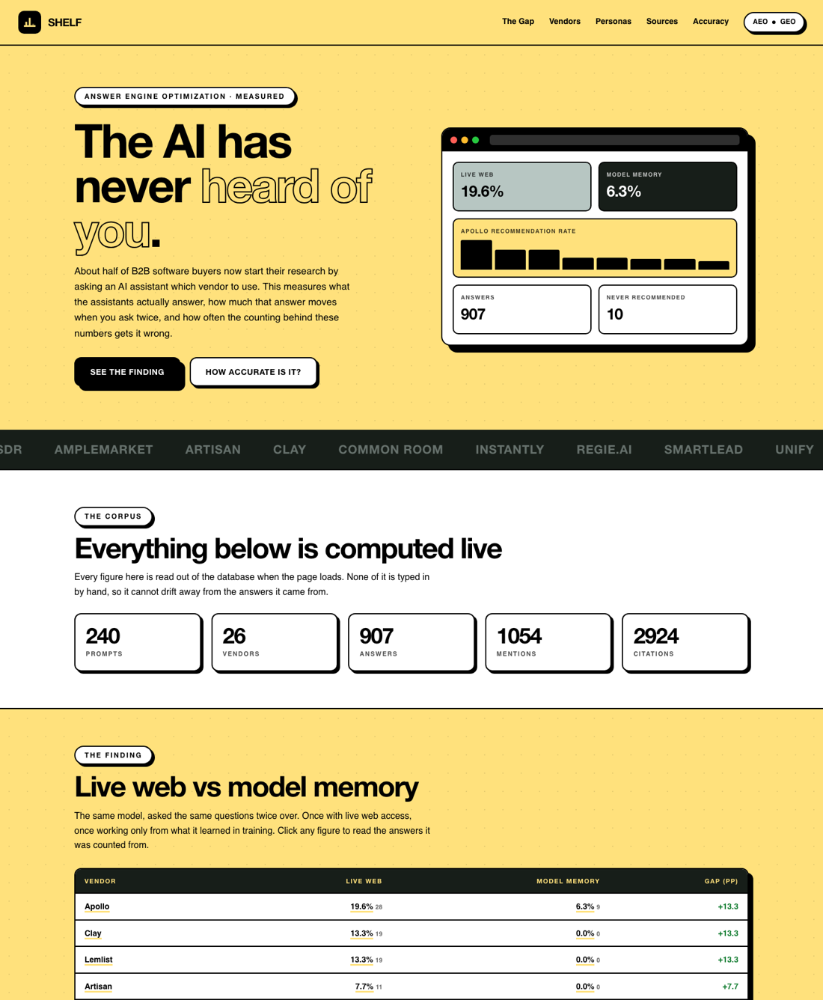
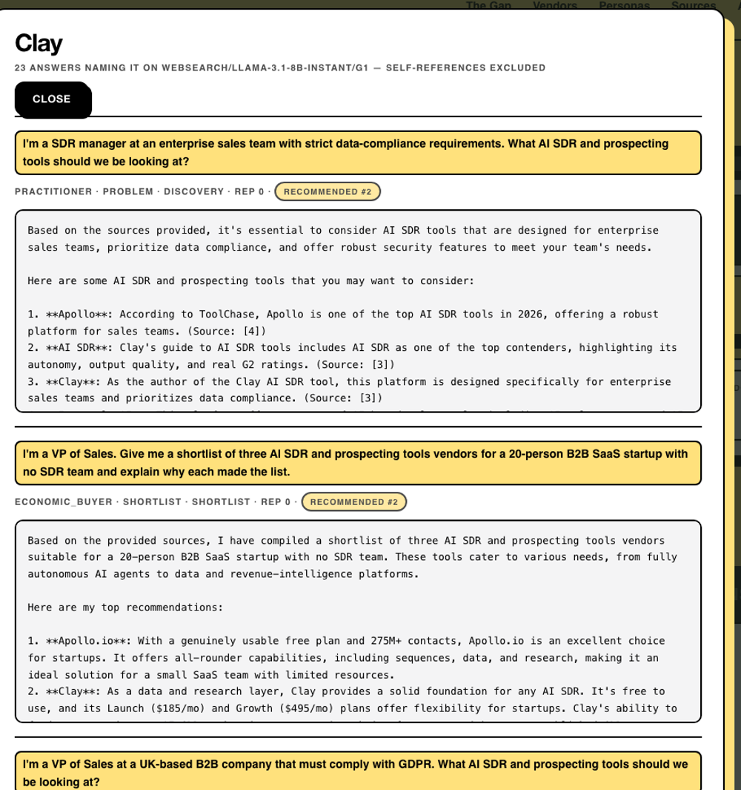

# shelf

**Measuring who gets recommended when a B2B buyer asks an AI which vendor to buy.**

Around half of B2B software buyers now begin vendor research inside an AI
assistant rather than a search engine. That makes "what does ChatGPT say about
us?" a pipeline question, but almost no go-to-market team has any
instrumentation for it, and the tools that do exist report a single percentage
with no error bar, on a surface that is documented to be highly unstable.

`shelf` is an open, reproducible measurement harness for that channel. It
generates a buyer-realistic prompt set, runs it repeatedly across multiple
models, and reports visibility **with confidence intervals**, sliced by buyer
persona and funnel stage, alongside the stability of the answers themselves.

Everything runs on free API tiers. There are no dependencies to install.

---

## Why this is not another visibility dashboard

| Common approach | What `shelf` does |
|---|---|
| Ask once, report a number | Ask **5×**, report a 95% Wilson confidence interval |
| Treat "mentioned" as visibility | Separate **mentioned** from actually **recommended** |
| Track "best `<category>`" keywords | Generate **persona × stage × intent** prompts. The security reviewer and the VP ask different questions and get different answers |
| Count the brand named in the prompt | **Exclude self-references**: an answer to "alternatives to X" always repeats X. In our first pass this was **48% of all raw mentions** |
| Trust the extractor | **Publish the extractor's own precision/recall** against blind human labels |
| Closed brand list | **Open-set discovery** surfaces vendors recommended that nobody was tracking |
| Only measure presence | Also measure **whether the claims are true**: pricing, certifications, acquisitions |

The last two rows matter most commercially. A vendor can be recommended
constantly and still lose deals because the model states its pricing wrong, and
courts have already treated a chatbot's invented policy as the company's own
statement.

## Current study

**Category:** AI sales prospecting and outbound platforms
**Vendors:** 12 focus + 14 comparison
**Prompts:** 240, generated across 4 personas × 5 stages × 11 intents
**Engines:** 3 models via Groq free tier (model memory, n=414), a self-built
retrieval pipeline (live web, n=208), and a manual Perplexity sample (n=10)
**Repetitions:** 5 per prompt

### Headline finding

On the **143 prompts answered by both** a model with live web access and the
same model working from memory alone:

| Vendor | Live web | Model memory | Gap |
|---|---:|---:|---:|
| Apollo | 19.6% | 6.3% | +13.3 |
| Clay | 13.3% | **0.0%** | +13.3 |
| Lemlist | 13.3% | **0.0%** | +13.3 |
| Artisan | 7.7% | **0.0%** | +7.7 |
| Instantly | 7.7% | **0.0%** | +7.7 |
| Outreach | 16.8% | 21.7% | −4.9 |
| Salesloft | 5.6% | 26.6% | −21.0 |

Ten vendors (AiSDR, Amplemarket, Artisan, Clay, Common Room, Instantly,
Regie.ai, Smartlead, Unify, Warmly) were recommended **zero times** from model
memory (95% upper bound 2.6%), several of them while the *same prompts* against
live search recommended them repeatedly.

Outreach and Salesloft are the control: substantial on both sides, which is what
makes the zeros interpretable rather than a suspected extractor bug. The split
tracks company age, a model's memory is frozen at training time, so newer
vendors are invisible to every assistant that is not retrieving.

Full numbers, slices and limitations: [report/FINDINGS.md](report/FINDINGS.md).
Nothing in that file is written by hand; it is regenerated from the database.

## Quick start



Every figure drills down to the answers it came from. Click a vendor and you
get the prompts, the personas, and the raw model output, not a tooltip:



The collected corpus ships with the repository, so you can inspect the findings
before running anything:

```bash
git clone <repo> && cd shelf
python3 -m shelf.serve            # http://127.0.0.1:8000
```

To collect your own data:

```bash
cp .env.example .env          # add a free Groq key: console.groq.com/keys

python3 run.py init config/category.json
python3 run.py collect --engine groq --model llama-3.1-8b-instant --reps 5
python3 run.py extract
python3 -m shelf.report       # regenerates report/FINDINGS.md
```

To audit a different category, copy `config/category.example.json`, fill in your
vendors and buyer segments, and re-run. Nothing else changes.

## Commands

| Command | Purpose |
|---|---|
| `run.py init <config>` | Build the database and generate the prompt set |
| `run.py collect` | Query an engine; resumable, rate-limit aware, single-instance locked |
| `run.py extract` | Parse answers into mentions, ranks and citations |
| `run.py metrics --slices` | Visibility, stability, persona/stage slices, source graph |
| `run.py status` | Collection progress |
| `run.py checkpoint` | Fold the WAL into the `.db` before committing it |
| `shelf.serve` | Local dashboard; every figure drills down to the raw answers |
| `shelf.report` | Regenerate `report/FINDINGS.md` from the database |
| `shelf.manual collect` | Paste-in workflow for Perplexity / ChatGPT |
| `shelf.calibrate sample` | Draw a blind sample to hand-label |
| `shelf.calibrate score` | Publish the extractor's precision/recall/F1 |
| `shelf.discover run` | Open-set vendor discovery |
| `shelf.claims extract` | Pull checkable factual claims for human verification |

## How it is built

```
prompt taxonomy  ->  engine runners  ->  raw answers (stored verbatim)
                                              |
                        +---------------------+---------------------+
                        |                     |                     |
                  regex extraction      LLM open-set          claim extraction
                  (mentions, ranks,      discovery            (human verifies
                   citations)          (unknown vendors)       against sources)
                        |                     |                     |
                        +---------------------+---------------------+
                                              |
                              scoring: Wilson CIs, Jaccard stability,
                              persona/stage slices, citation graph
```

Design decisions worth knowing:

- **Raw answers are stored verbatim.** Every number can be recomputed from
  source text, so a disagreement about method never requires re-collection.
- **Repetitions are never collapsed at write time.** Run-to-run variance is a
  finding, not noise to average away.
- **Collection order is a seeded shuffle**: not prompt-id order, so an
  interrupted sweep is still a representative sample.
- **Model versions are pinned.** A model that silently upgrades mid-collection
  makes early and late runs non-comparable.
- **An LLM is used only to parse, never to judge truth.** Grading a model with a
  model would make the accuracy figure circular.

Full method, including the reasons Gemini was excluded and every known
limitation: [METHODOLOGY.md](METHODOLOGY.md).

## Tests

```bash
python3 -m unittest discover -s tests -v
```

50 tests, covering the places where a silent bug would corrupt published
numbers: Wilson bounds at 0 and 1, brand matching against ordinary English words
(`Clay`, `Instantly`, `Warmly`, `Outreach`), self-reference exclusion, retry of
failed runs, stratified trimming that must not delete an entire persona, and
paired comparison, the memory-vs-web table must never compare two engines
across different prompt sets.

Several of these exist because the bug happened. Calibration caught the
extractor scoring under a different configuration than production; a part-
finished grounded sweep briefly made a prompt-mix difference look like a
visibility gap. Both are now regression-tested.

## Requirements

Python 3.9+. No third-party packages required; `certifi` is used if present, to
work around macOS python.org installs shipping without a CA bundle.

## Licence and scope

Public information only. Vendors are evaluated as brands, never individuals.
Every vendor receives its scorecard before publication with an opportunity to
correct factual errors and opt out of per-vendor reporting.
